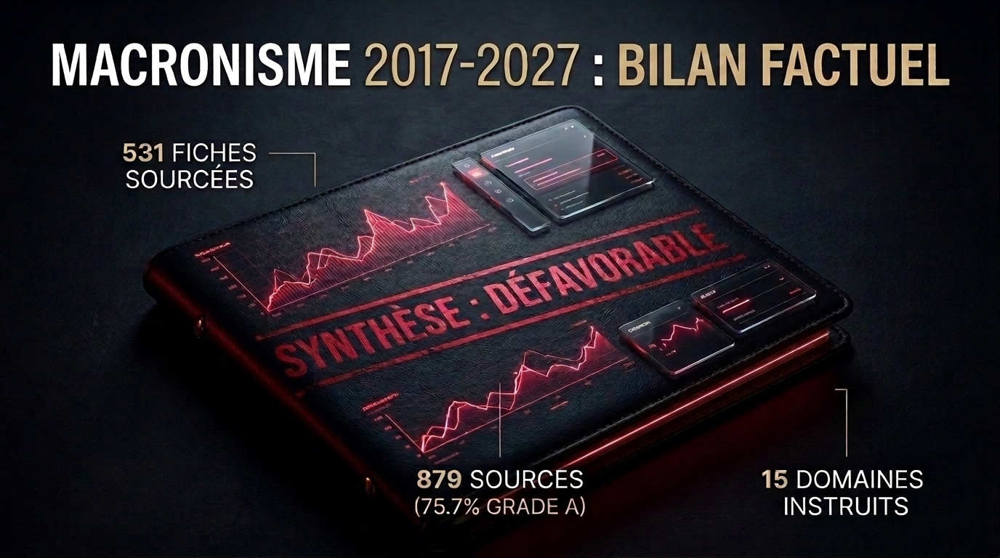

# Macronisme : le bilan

Dossier documentaire sur les deux quinquennats d'Emmanuel Macron, mai 2017 à
juillet 2026. **531 fiches** datées et sourcées, **879 URL distinctes**, quinze
domaines instruits, quinze jugements motivés et une synthèse.

**Lecture confortable : [macronisme-le-bilan.netlify.app](https://macronisme-le-bilan.netlify.app)**
Ce dépôt contient la matière. Le site en est la lecture, avec la navigation,
les liens entre pièces et les vues par acteur et par période.

## Ce que c'est

Un dossier bâti sur pièces gradées, pas un récit illustré par des exemples.
Chaque fait est une fiche datée, sourcée, affectée d'un grade de preuve. Les
jugements sont rendus ensuite, dans des fichiers séparés, et ne modifient
jamais les faits.

Vous pouvez rejeter l'intégralité des jugements et garder l'intégralité des
faits. C'est la garantie principale de cette construction.

| | |
|---|---|
| Fiches | 531 |
| URL sources distinctes | 879 |
| Grade A (document officiel, jugement définitif) | 402 (75,7 %) |
| Grade B (plusieurs sources de presse indépendantes) | 115 (21,7 %) |
| Grade C (allégation à source unique) | 14 (2,6 %) |
| Grade D (rumeur) | 0 |
| Domaines instruits | 15 |
| Période couverte | mai 2017 à juillet 2026 |

Les sources les plus citées sont Légifrance (200 occurrences), le Sénat (76),
vie-publique.fr (56), l'Assemblée nationale (48) et la Cour des comptes (40).
La première source de presse généraliste arrive en seizième position.

## Structure

```
base/         531 fiches factuelles, une par pièce, AAAA-MM-JJ-slug.md
jugement/     15 pièces de jugement (une par domaine) + synthese.md
METHODE.md    comment ce dossier est construit et ce que vaut chaque affirmation
atlas/        générateur et front du site (TypeScript, Bun)
atelier/      la matière première : rapports de recherche bruts, chronologie
              de travail, méthodes d'origine, notes de session, prompts de run
```

Les renvois entre fiches utilisent la syntaxe `[[slug]]`. Ces liens ne sont pas
cliquables sur GitHub ; ils le sont sur le site.

## Les verdicts

Échelle commune à cinq niveaux : très favorable, favorable, mitigé, défavorable,
gravement défavorable. Tous datés du 31/07/2026.

| Domaine | Verdict |
|---|---|
| ecologie-energie | défavorable |
| economie | défavorable |
| education-recherche | défavorable |
| europe | défavorable |
| finances-publiques | défavorable |
| industrie | défavorable |
| institutions | défavorable |
| **international** | **mitigé** |
| justice-affaires | défavorable |
| libertes-publiques | défavorable |
| **promesses** | **mitigé** |
| retraites-social | défavorable |
| sante | défavorable |
| securite-civile | défavorable |
| securite-immigration | défavorable |
| **Synthèse d'ensemble** | **défavorable** |

Le verdict d'ensemble ne résulte pas d'un décompte : treize défavorables sur
quinze n'impliquent par eux-mêmes aucun niveau. Il se rend sur des fils
transverses qui ont survécu à un test de contradiction, et il refuse
explicitement le cran supérieur au motif que les décharges ne sont marginales
dans aucun domaine. Les motifs sont dans
[`jugement/synthese.md`](jugement/synthese.md).

## Comment ce dossier se défend

Trois dispositifs, détaillés dans [`METHODE.md`](METHODE.md) :

- **Le grade commande la force de l'affirmation.** Une affirmation portée
  uniquement par une source unique ne peut jamais être déterminante dans un
  verdict. Le grade D n'entre pas dans la base.
- **Le test de contradiction.** Toute charge subit quatre attaques avant
  d'entrer dans une pièce : comparaison historique, biais de période ou de
  mesure, nature juridique exacte, solidité des pièces. Celles qui échouent
  sont listées avec leur raison, dans une section dédiée de chaque pièce.
- **Les retournements de charge sont fournis par le dossier lui-même.** Cinq
  comparaisons historiques jouent contre la thèse d'une rupture propre à la
  période (le record de 49.3 appartient à Michel Rocard, la hausse des
  ordonnances date de 2007, le rythme hebdomadaire des conseils de défense est
  institué en 2016, etc.). Elles sont dans `METHODE.md` §7, parce qu'un dossier
  honnête fournit lui-même la meilleure défense disponible.

Les limites connues sont dites en clair : déséquilibre de couverture entre
2017-2022 et 2024-2026, corpus international mince, instruments sans série
comparative, et une origine à charge déclarée plutôt que dissimulée.

## L'atelier est publié aussi, et rien n'y fait foi

`atelier/` contient la matière première : les 15 rapports de recherche bruts,
la chronologie de travail, les méthodes d'origine, les notes de session et les
prompts de run. Tout est là pour que la méthode soit vérifiable jusqu'à sa
source.

Une mise en garde, qui vaut d'être lue avant d'en citer quoi que ce soit. Ces
rapports sont des sorties **avant tri**. Ils contiennent des affirmations qui
n'ont pas survécu à la vérification, des identifiants de loi et des URL
inventés par les moteurs de recherche, des angles d'investigation qui ont
échoué, et des inférences étiquetées comme telles. **Neuf des quinze rapports
déclarent explicitement une couverture non convergée.**

Ce qui fait foi est dans `base/`, fiche par fiche, avec sa source et son grade.
Le reste dit comment le travail a été fait, pas ce qu'il conclut. Le détail est
dans [`atelier/README.md`](atelier/README.md), y compris la liste complète des
retouches faites avant publication.

## Reprendre ce travail

Le dossier est arrêté au 30/07/2026 et conçu pour être prolongé jusqu'en 2027.
[`CLAUDE.md`](CLAUDE.md) décrit la procédure complète : ajouter une fiche,
ouvrir un nouveau domaine, réviser un jugement après un événement majeur,
rejouer le site. Les invariants à ne pas casser y sont listés.

Reconstruire le site :

```bash
cd atlas
bun install
bun run build.ts                                                  # données
bun build ./src/app.ts --outdir ./dist --minify --target browser  # front
open dist/index.html
```

Les corrections factuelles sont bienvenues par issue ou pull request, à la
condition qui vaut pour tout le dossier : une source vérifiable, et un grade
qui correspond à ce que la source établit réellement.

## Licence

Le contenu rédigé (`base/`, `jugement/`, `atelier/`, `METHODE.md`, ce fichier)
est sous [**CC BY 4.0**](LICENSE) : partage et adaptation libres, y compris à
des fins commerciales, sous la seule condition de créditer l'auteur, de fournir
un lien vers la licence et d'indiquer si des modifications ont été faites.

Le code du site (`atlas/`) est sous [**MIT**](atlas/LICENSE).

Citation suggérée :

> Romain Ecarnot, « Macronisme : le bilan » (2026),
> https://macronisme-le-bilan.netlify.app (CC BY 4.0)

**Portée de l'attribution.** La licence couvre la rédaction, la structuration,
la gradation des preuves et les jugements de ce dépôt. Elle **ne couvre pas les
documents-sources cités** (textes officiels, articles de presse, rapports
publics), qui restent régis par leurs propres régimes de droits. Les URL des
sources sont fournies pour permettre la vérification, pas la redistribution.
C'est la raison pour laquelle l'annexe de vérification tirée d'un article du
Guardian est réduite aux seuls verbatims cités par la fiche correspondante.

## Auteur

Romain Ecarnot, avec l'aide de Claude (Anthropic), Antigravity (Google), Grok (SpaceXAI) et Sonar-pro (Perplexity).

La recherche documentaire a été menée avec assistance d'IA ; la vérification
des sources, l'attribution des grades et tous les verdicts sont humains. Le
dispositif de recherche est public et reproductible : plugin
[`erom-research`](https://github.com/eRom/erom-research), disponible sur la
marketplace [`erom-marketplace`](https://github.com/eRom/erom-marketplace).

Ce dossier n'appelle à voter pour personne et ne formule aucun pronostic. Il
se clôt sur les questions que le bilan permet de poser à quiconque revendique
cet héritage ou le combat.
